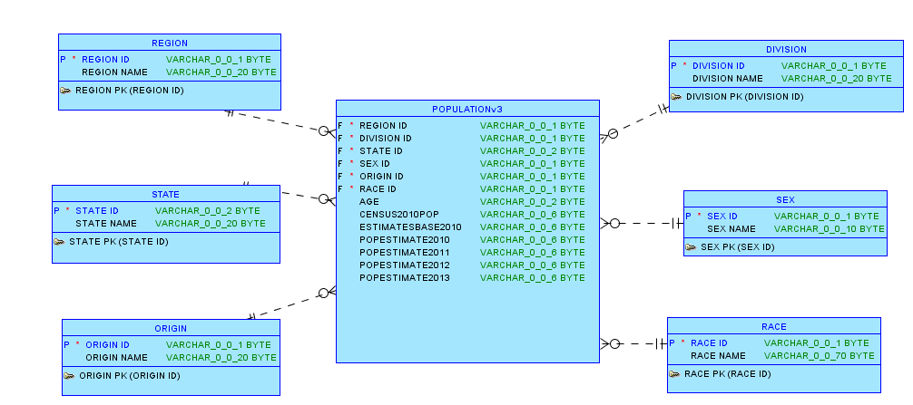
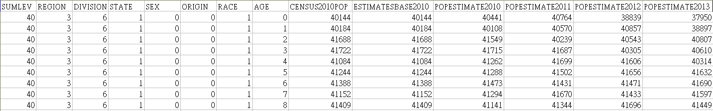
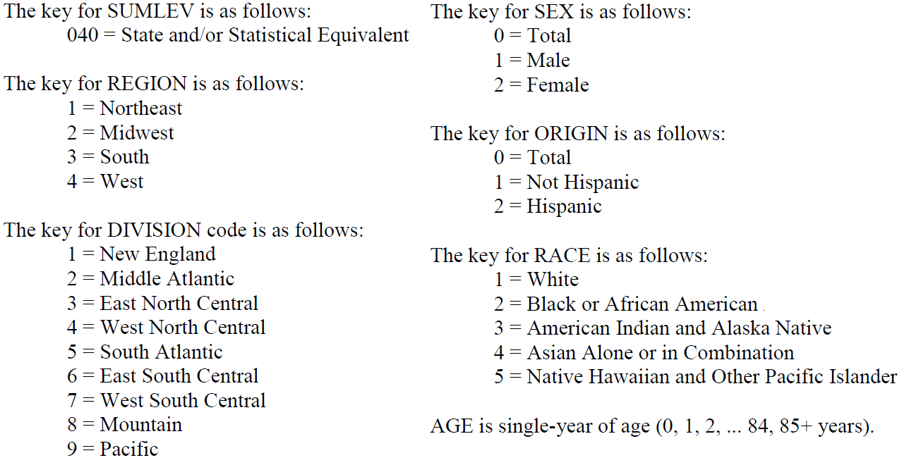

Data Science Fall 2014 R Project
===
**This project analyzes the Population of the United States in 2010 and stored in an Oracle database.**

###My RStudio configurtion:
```{r}
sessionInfo()
```

###Logical Model of the Database
 

###First few rows of population.csv
 


###The keys for sereval attributes in population.csv



###Data Analysis

```{r}
source("./plots.r", echo=TRUE)
```


