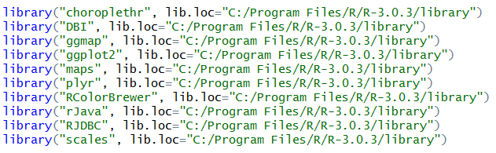

Data Science Fall 2014 R Project
===
**This project documents the processes of analyzing the Population of the United States in 2010, where the data is stored in an Oracle database.**

##My RStudio configurtion
```{r}
sessionInfo()
```


##My RStudio Packages

******
 


##Logical Model of the Database
******
 
******


##First few rows of population.csv
******
 
******


##The keys for certain attributes in population.csv
******

******


##Data Analysis


```{r}
source("../03Analysis/plots.r", echo=TRUE)
```


